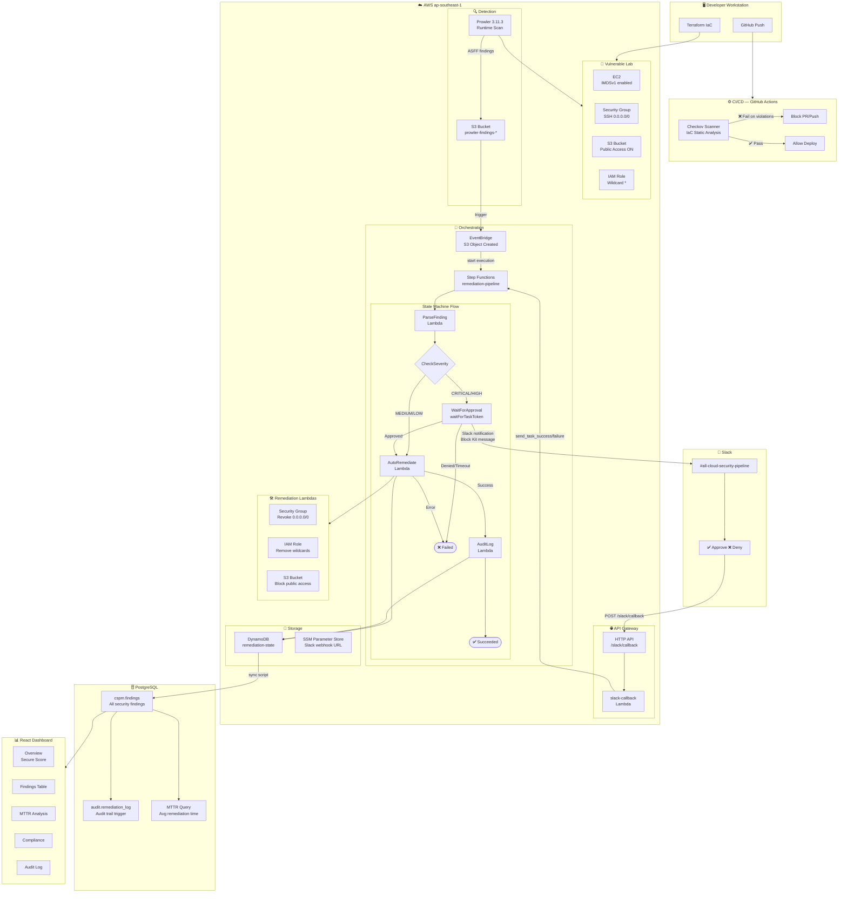

# 🔐 Cloud Security Pipeline

> **Automated Cloud Security Posture Management (CSPM) with Human-in-the-Loop Remediation**

[](https://aws.amazon.com)
[](https://terraform.io)
[](https://python.org)
[](https://react.dev)
[](https://checkov.io)
[](https://prowler.com)

---

## 📋 Overview

A production-grade automated security pipeline that:

- **Detects** misconfigurations across AWS resources using Prowler and Checkov
- **Orchestrates** remediation workflows via AWS Step Functions
- **Notifies** security engineers via Slack with Approve/Deny buttons
- **Auto-remediates** confirmed findings (Security Groups, IAM, S3)
- **Audits** all activity in PostgreSQL with full change history
- **Visualizes** security posture via a real-time React dashboard

---

## 🏗️ Architecture



---

## 🛠️ Tech Stack

| Layer | Technology |
|---|---|
| **Infrastructure as Code** | Terraform 1.14 |
| **Cloud Provider** | AWS (Lambda, Step Functions, EventBridge, DynamoDB, S3, IAM, API Gateway, SSM) |
| **IaC Security Scanner** | Checkov 3.2.508 |
| **Cloud Security Scanner** | Prowler 3.11.3 |
| **Orchestration** | AWS Step Functions (waitForTaskToken pattern) |
| **Notification** | Slack Block Kit + Incoming Webhooks |
| **Remediation** | Python 3.12 Lambda functions |
| **Audit Database** | PostgreSQL 18 (schemas: cspm, audit) |
| **Dashboard** | React + Recharts |
| **CI/CD** | GitHub Actions |

---

## 📁 Project Structure

```
cloud-security-pipeline/
├── terraform/
│   ├── vulnerable-lab/          # Intentionally misconfigured AWS resources
│   │   ├── main.tf              # EC2, SG, S3, IAM with planted vulnerabilities
│   │   └── outputs.tf
│   └── security-pipeline/       # Remediation infrastructure
│       ├── main.tf              # Lambda, Step Functions, EventBridge, API GW
│       └── outputs.tf
├── lambda/
│   └── remediation/
│       ├── parse_finding.py     # Parses S3 events + idempotency check
│       ├── remediate.py         # SG / IAM / S3 remediation logic
│       ├── notify_slack.py      # Sends Block Kit approval message
│       ├── slack_callback.py    # Handles Approve/Deny button clicks
│       ├── audit_logger.py      # Writes findings to PostgreSQL
│       └── sync_to_postgres.py  # DynamoDB → PostgreSQL sync
├── dashboard-app/               # React cyberpunk security dashboard
│   └── src/
│       └── App.js               # 5-tab dashboard with Recharts
├── .github/
│   └── workflows/
│       └── checkov-scan.yml     # CI/CD IaC scanning pipeline
└── prowler-output/
    └── sample-findings.asff.json
```

---

## 🚀 Pipeline Flow

```
1. Developer pushes IaC code
        ↓
2. GitHub Actions runs Checkov (blocks if violations found)
        ↓
3. Terraform deploys vulnerable lab (for testing)
        ↓
4. Prowler scans AWS account → outputs ASFF findings → uploads to S3
        ↓
5. EventBridge detects S3 upload → triggers Step Functions
        ↓
6. ParseFinding Lambda extracts resource details + idempotency check
        ↓
7. CheckSeverity routes:
   CRITICAL/HIGH  → Slack approval required
   MEDIUM/LOW     → Auto-remediate immediately
        ↓
8. Slack message sent with ✅ Approve / ❌ Deny buttons
        ↓
9. Engineer clicks Approve → API Gateway → slack-callback Lambda
        ↓
10. send_task_success() resumes Step Functions
        ↓
11. Remediate Lambda fixes the resource:
    Security Group  → revoke_security_group_ingress (remove 0.0.0.0/0)
    IAM Role        → put_role_policy (replace Allow:* with Deny:*)
    S3 Bucket       → put_public_access_block (all 4 flags = true)
        ↓
12. DynamoDB records REMEDIATED status + approver
        ↓
13. PostgreSQL audit trigger logs all changes automatically
        ↓
14. React dashboard shows real-time Cloud Secure Score
```

---

## 📊 Remediation Coverage

| Check ID | Resource | Issue | Action |
|---|---|---|---|
| CKV_AWS_24 | Security Group | SSH open to 0.0.0.0/0 | Revoke ingress rule |
| CKV_AWS_25 | Security Group | RDP open to 0.0.0.0/0 | Revoke ingress rule |
| CKV_AWS_40 | IAM Role | Wildcard `Action: *` | Replace with Deny policy |
| CKV_AWS_53 | S3 Bucket | Public access enabled | Enable all 4 block flags |
| CKV_AWS_79 | EC2 Instance | IMDSv1 enabled | Flag for manual review |

---

## 📈 Cloud Secure Score Formula

$$S_{score} = \max\left(0,\ 100 - \frac{\sum_{i=1}^{N}(V_i \times W_i)}{T_{max}}\right)$$

| Severity | Weight |
|---|---|
| CRITICAL | 64 |
| HIGH | 16 |
| MEDIUM | 4 |
| LOW | 1 |

---

## 🗄️ Database Schema

```sql
-- cspm.findings — stores all security findings
CREATE TABLE cspm.findings (
    id               SERIAL PRIMARY KEY,
    event_id         VARCHAR(255) UNIQUE NOT NULL,
    check_id         VARCHAR(100),
    severity         VARCHAR(20),
    resource_type    VARCHAR(100),
    resource_id      VARCHAR(255),
    description      TEXT,
    status           VARCHAR(50),
    discovery_date   TIMESTAMP DEFAULT NOW(),
    remediation_date TIMESTAMP,
    approver         VARCHAR(100)
);

-- MTTR Query
SELECT severity,
  AVG(EXTRACT(EPOCH FROM (remediation_date - discovery_date)) / 60) AS avg_mttr_minutes
FROM cspm.findings
WHERE remediation_date IS NOT NULL
GROUP BY severity;
```

---

## 🔧 Setup

```bash
# 1. Clone
git clone https://github.com/KanthiPhoosorn/cloud-security-pipeline.git
cd cloud-security-pipeline

# 2. Configure AWS
aws configure

# 3. Deploy vulnerable lab
cd terraform/vulnerable-lab
terraform init && terraform apply

# 4. Deploy security pipeline
cd ../security-pipeline
terraform init && terraform apply

# 5. Run Prowler scan
prowler aws -M json-asff -o ./prowler-output

# 6. Upload findings to S3
aws s3 cp prowler-output/findings.json s3://prowler-findings-ACCOUNT_ID/findings/

# 7. Start dashboard
cd ../../dashboard-app
npm install && npm start
```

---

## 👤 Author

**Kanthi Phoosorn**
Software Engineering Student — Mae Fah Luang University, Thailand

- 🔗 [LinkedIn](https://linkedin.com/in/kanthi-phoosorn-238644392)
- 🐙 [GitHub](https://github.com/KanthiPhoosorn)
- 🛡️ [TryHackMe](https://tryhackme.com/p/7083343)

---
