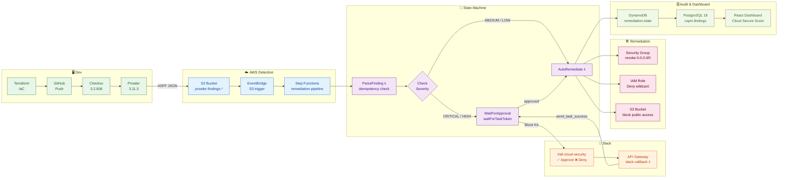

# 🔐 Cloud Security Pipeline

> **Automated Cloud Security Posture Management (CSPM) with Human-in-the-Loop Remediation**

[](https://aws.amazon.com)
[](https://terraform.io)
[](https://python.org)
[](https://react.dev)
[](https://checkov.io)
[](https://prowler.com)

---

## 📋 Overview

A production-grade automated security pipeline that:

- **Detects** misconfigurations across AWS resources using Prowler and Checkov
- **Orchestrates** remediation workflows via AWS Step Functions
- **Notifies** security engineers via Slack with Approve/Deny buttons
- **Auto-remediates** confirmed findings (Security Groups, IAM, S3)
- **Audits** all activity in PostgreSQL with full change history
- **Visualizes** security posture via a real-time React dashboard

---

## 🏗️ Architecture
```
┌─────────────────────────────────────────────────────────────────┐
│  DEVELOPER WORKFLOW                                             │
│  Terraform IaC ──► GitHub Actions (Checkov 3.2.508) ──► Prowler│
└──────────────────────────────┬──────────────────────────────────┘
                               │ ASFF findings
┌──────────────────────────────▼──────────────────────────────────┐
│  AWS DETECTION LAYER                                            │
│  S3 (prowler-findings-*) ──► EventBridge ──► Step Functions     │
└──────────────────────────────┬──────────────────────────────────┘
                               │ start execution
┌──────────────────────────────▼──────────────────────────────────┐
│  STATE MACHINE                                                  │
│  ParseFinding ──► CheckSeverity                                 │
│                       ├─ CRITICAL/HIGH ──► WaitForApproval      │
│                       └─ MEDIUM/LOW ────► AutoRemediate         │
└──────────┬───────────────────┬──────────────────────────────────┘
           │ notify            │ approved
┌──────────▼──────────┐        │
│  SLACK APPROVAL     │        │
│  #all-cloud-security│        │
│  API GW + callback ─┼────────┘
└─────────────────────┘
┌─────────────────────────────────────────────────────────────────┐
│  REMEDIATION LAMBDAS                                            │
│  Security Group     IAM Role            S3 Bucket               │
│  revoke 0.0.0.0/0   replace wildcard    block public access     │
└──────────────────────────────┬──────────────────────────────────┘
                               │ write status
┌──────────────────────────────▼──────────────────────────────────┐
│  AUDIT & OBSERVABILITY                                          │
│  DynamoDB ──► PostgreSQL (cspm.findings + audit log) ──► React  │
│                              Cloud Secure Score + MTTR Dashboard│
└─────────────────────────────────────────────────────────────────┘
```

---

## 🔄 Detailed Flow


---

## 🛠️ Tech Stack

| Layer | Technology |
|---|---|
| **Infrastructure as Code** | Terraform 1.14 |
| **Cloud Provider** | AWS (Lambda, Step Functions, EventBridge, DynamoDB, S3, IAM, API Gateway, SSM) |
| **IaC Security Scanner** | Checkov 3.2.508 |
| **Cloud Security Scanner** | Prowler 3.11.3 |
| **Orchestration** | AWS Step Functions (waitForTaskToken pattern) |
| **Notification** | Slack Block Kit + Incoming Webhooks |
| **Remediation** | Python 3.12 Lambda functions |
| **Audit Database** | PostgreSQL 18 (schemas: cspm, audit) |
| **Dashboard** | React + Recharts |
| **CI/CD** | GitHub Actions |

---

## 📁 Project Structure
```
cloud-security-pipeline/
├── terraform/
│   ├── vulnerable-lab/          # Intentionally misconfigured AWS resources
│   └── security-pipeline/       # Remediation infrastructure
├── lambda/
│   └── remediation/
│       ├── parse_finding.py     # Parses findings + idempotency check
│       ├── remediate.py         # SG / IAM / S3 remediation logic
│       ├── notify_slack.py      # Block Kit approval message
│       ├── slack_callback.py    # Approve/Deny handler
│       ├── audit_logger.py      # PostgreSQL writer
│       └── sync_to_postgres.py  # DynamoDB → PostgreSQL sync
├── dashboard-app/               # React cyberpunk dashboard
│   └── src/App.js
├── .github/workflows/
│   └── checkov-scan.yml         # CI/CD IaC scanning
└── prowler-output/
    └── sample-findings.asff.json
```

---

## 🚀 Pipeline Flow
```
1.  Developer pushes IaC → GitHub Actions runs Checkov (hard gate)
2.  Terraform deploys vulnerable lab
3.  Prowler scans AWS → ASFF findings → S3
4.  EventBridge detects upload → Step Functions triggered
5.  ParseFinding Lambda → idempotency check via DynamoDB
6.  CheckSeverity: CRITICAL/HIGH → Slack approval / MEDIUM/LOW → auto
7.  Slack Block Kit message → engineer clicks ✅ Approve
8.  API Gateway → slack-callback → send_task_success()
9.  AutoRemediate Lambda fixes resource
10. DynamoDB records REMEDIATED + approver
11. PostgreSQL audit trigger logs all changes
12. React dashboard shows real-time Cloud Secure Score
```

---

## 📊 Remediation Coverage

| Check ID | Resource | Issue | Action |
|---|---|---|---|
| CKV_AWS_24 | Security Group | SSH open to 0.0.0.0/0 | Revoke ingress rule |
| CKV_AWS_25 | Security Group | RDP open to 0.0.0.0/0 | Revoke ingress rule |
| CKV_AWS_40 | IAM Role | Wildcard `Action: *` | Replace with Deny policy |
| CKV_AWS_53 | S3 Bucket | Public access enabled | Enable all 4 block flags |
| CKV_AWS_79 | EC2 Instance | IMDSv1 enabled | Flag for manual review |

---

## 📈 Cloud Secure Score

Weights: CRITICAL=64, HIGH=16, MEDIUM=4, LOW=1

`Score = max(0, 100 - (sum of open finding weights / total possible) × 100)`

---

## 🗄️ Database Schema
```sql
CREATE TABLE cspm.findings (
    event_id         VARCHAR(255) UNIQUE NOT NULL,
    check_id         VARCHAR(100),
    severity         VARCHAR(20),
    resource_type    VARCHAR(100),
    resource_id      VARCHAR(255),
    status           VARCHAR(50),
    discovery_date   TIMESTAMP DEFAULT NOW(),
    remediation_date TIMESTAMP,
    approver         VARCHAR(100)
);
```

---

## 🔧 Quick Start
```bash
git clone https://github.com/KanthiPhoosorn/cloud-security-pipeline.git
cd cloud-security-pipeline
aws configure
cd terraform/vulnerable-lab && terraform init && terraform apply
cd ../security-pipeline && terraform init && terraform apply
prowler aws -M json-asff -o ./prowler-output
cd ../../dashboard-app && npm install && npm start
```

---

## 👤 Author

**Kanthi Phoosorn** — Software Engineering, Mae Fah Luang University, Thailand

- 🔗 [LinkedIn](https://linkedin.com/in/kanthi-phoosorn-238644392)
- 🐙 [GitHub](https://github.com/KanthiPhoosorn)
- 🛡️ [TryHackMe](https://tryhackme.com/p/7083343)
- 📜 Google Cybersecurity Certificate — `coursera.org/verify/9C6XUE70WV0Q`

**Target:** MSc Cybersecurity — Georgia Tech 🇺🇸 (August 2028)
